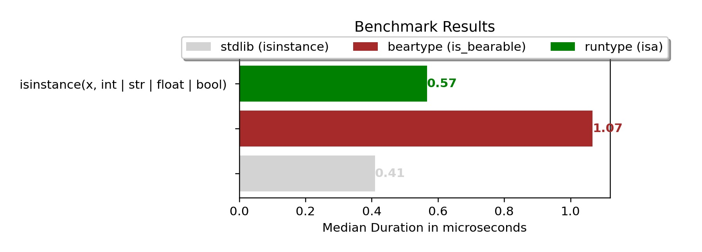
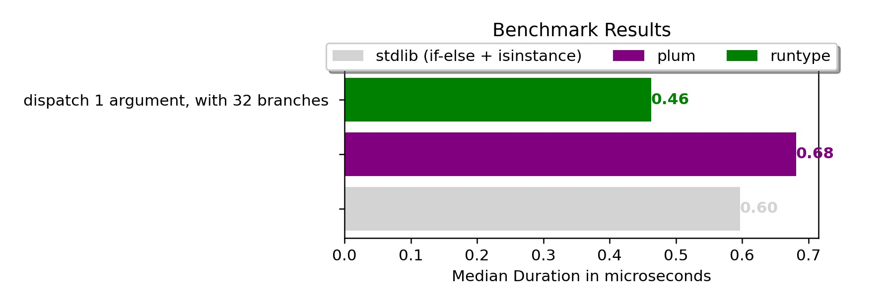

Runtype is a collection of run-time type utilities for Python.

It is:

:runner: Fast! Uses an internal typesystem for maximum performance.

:brain: Smart! Supports `typing`, forward-references, constraints, auto-casting, and more.

:gear: Configurative! Write your own type system, and use it with *dataclass* and *dispatch*.

------

### Modules

- :star: [**validation**](https://runtype.readthedocs.io/en/latest/validation.html) - Provides a smarter alternative to `isinstance` and `issubclass`, with support for the `typing` module, and type constraints.

- :star: [**dataclass**](https://runtype.readthedocs.io/en/latest/dataclass.html) - Adds run-time type validation to the built-in dataclass.

    - Improves dataclass ergonomics.
    - Supports most mypy constructs, like `typing` and forward-references (`foo: 'Bar'`).
    - Supports automatic value casting, Pydantic-style. (Optional, off by default)
    - Supports types with constraints. (e.g. `String(max_length=10)`)
    - Supports optional sampling for faster validation of big lists and dicts.
    - Twice faster than Pydantic-v1 with pure Python ([read here](https://runtype.readthedocs.io/en/latest/dataclass.html#compared-to-pydantic))

- :star: [**dispatch**](https://runtype.readthedocs.io/en/latest/dispatch.html) - Provides fast multiple-dispatch for functions and methods, via a decorator.

    - Dispatch on multiple arguments
    - Full [specificity](https://runtype.readthedocs.io/en/latest/dispatch.html#specificity) resolution
    - [Supports mypy](https://runtype.readthedocs.io/en/latest/dispatch.html#mypy-support), by utilizing the `@overload` decorator
    - Inspired by Julia.

- :star: [**type utilities**](https://runtype.readthedocs.io/en/latest/types.html) - Provides a set of classes to implement your own type-system.

    - Supports generics, constraints, phantom types
    - Used by runtype itself, to emulate the Python type-system.
 

## Docs

Read the docs here: https://runtype.readthedocs.io/

## Install

```bash
pip install runtype
```

No dependencies.

Requires Python 3.8 or up.

[](https://codecov.io/gh/erezsh/runtype)

## Examples

### Validation (Isa & Subclass)

Use `isa` and `issubclass` as a smarter alternative to the builtin isinstance & issubclass -

```python
from runtype import isa, issubclass

assert isa({'a': 1}, dict[str, int])        # == True
assert not isa({'a': 'b'}, dict[str, int])  # == False

assert issubclass(dict[str, int], typing.Mapping[str, int])     # == True
assert not issubclass(dict[str, int], typing.Mapping[int, str]) # == False
```

### Dataclasses

```python
from runtype import dataclass

@dataclass(check_types='cast')  # Cast values to the target type, when applicable
class Person:
    name: str
    birthday: datetime = None   # Implicit optional
    interests: list[str] = []   # The list is copied for each instance


print( Person("Beetlejuice") )
#> Person(name='Beetlejuice', birthday=None, interests=[])
print( Person("Albert", "1955-04-18T00:00", ['physics']) )
#> Person(name='Albert', birthday=datetime.datetime(1955, 4, 18, 0, 0), interests=['physics'])
print( Person("Bad", interests=['a', 1]) )
# TypeError: [Person] Attribute 'interests' expected value of type list[str]. Instead got ['a', 1]
#     Failed on item: 1, expected type str
```

### Multiple Dispatch

Runtype dispatches according to the most specific type match -

```python
from runtype import multidispatch as md

@md
def mul(a: list, b: list):
    return [mul(i, j) for i, j in zip(a, b, strict=True)]
@md
def mul(a: list, b: Any):
    return [ai*b for ai in a]
@md
def mul(a: Any, b: list):
    return [bi*b for bi in b]
@md
def mul(a: Any, b: Any):
    return a * b

assert mul("a", 4)         == "aaaa"        # Any, Any
assert mul([1, 2, 3], 2)   == [2, 4, 6]     # list, Any
assert mul([1, 2], [3, 4]) == [3, 8]        # list, list

```

Dispatch can also be used for extending the dataclass builtin `__init__`:

```python
@dataclass(frozen=False)
class Point:
    x: int = 0
    y: int = 0
    
    @md
    def __init__(self, points: list | tuple):
        self.x, self.y = points

    @md
    def __init__(self, points: dict):
        self.x = points['x']
        self.y = points['y']
    
# Test constructors
p0 = Point()                         # Default constructor
assert p0 == Point(0, 0)             # Default constructor
assert p0 == Point([0, 0])           # User constructor
assert p0 == Point((0, 0))           # User constructor
assert p0 == Point({"x": 0, "y": 0}) # User constructor
```

## Benchmarks

Runtype beats its competition handily. It is significantly faster than both *beartype* and *plum*, and in some cases is even faster than regular Python code.

See the [benchmarks page](https://runtype.readthedocs.io/en/latest/benchmarks.html) in the documentation for detailed benchmarks.





## License

Runtype uses the [MIT license](LICENSE).

## Contribute

If you like Runtype and want to see it grow, you can help by:

- Reporting bugs or suggesting features

- Submitting pull requests (better to ask me first)

- Writing about runtype in a blogpost or even a tweet
