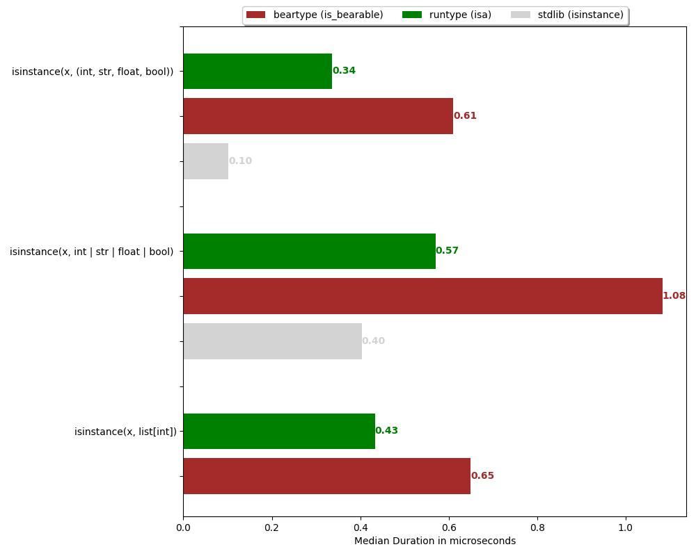
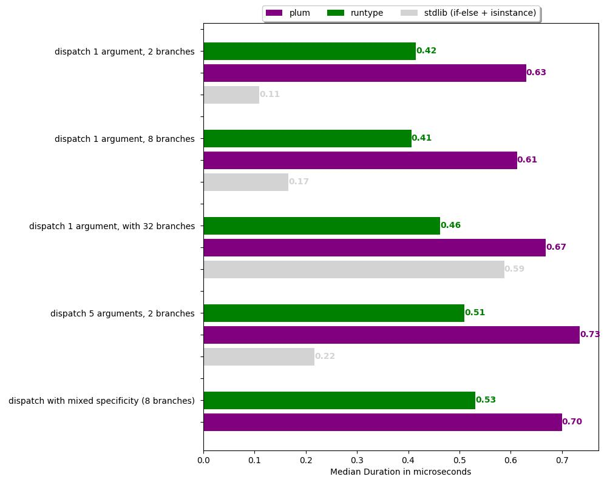
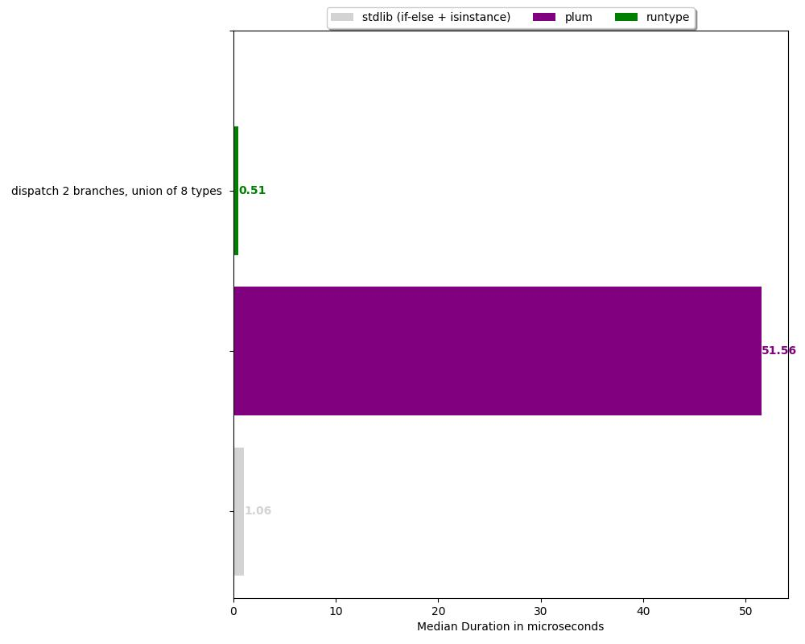

Benchmarks
==========

The following benchmarks were run using `pytest-benchmark` and plotted using `matplotlib`.

The code for running and plotting these benchmarks is included in the repo.
See: ``docs/generate_benchmarks.sh``

Benchmark contributions for more use-cases or new libraries are welcome!

.. _benchmarks-validation:

Validation (isinstance)
-----------------------

In the image below, we can see runtype is faster than its (only?) competitor, the library `beartype <https://github.com/beartype/beartype>`_.

We can see the native ``isinstance()`` is faster than runtype's ``isa()``. However, it isn't quite a fair comparison,
because it doesn't support all the types that ``isa()`` supports.

**Conclusion: Runtype beats the competition!**

.. _benchmarks-dispatch:

Dispatch
--------

In the images below, we cann see runtyp's multiple dispatch is faster than its (only?) competitor, the library `plum <https://github.com/beartype/plum>`_.

We can see that the naive approach of using if-else is faster for a small amount of branches,
but by 32 branches runtype is already significantly faster.

Curiously, for dispatching to unions of types, runtype is twice faster (!) than the naive if-else approach,
even for a very low number of branches.

It's worth noting that using while using if-else is sometimes faster, it is order-sensitive, and lacks important abilities that runtype offers, such as specificity-resolution on multiple arguments.

**Conclusion: Runtype beats the competition, and sometimes the if-else approach too!**

